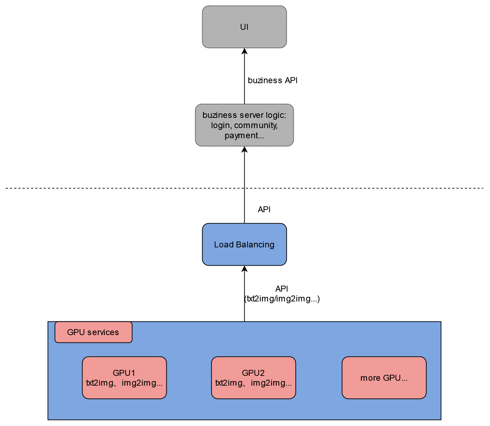

# Stable Diffusion Multi-user
> stable diffusion multi-user server API deployment that supports autoscaling, webui extension API...

# Contents:

- [[Option-1] Deploy with Django API](https://github.com/wolverinn/stable-diffusion-multi-user#option-1-deploy-with-django-api)
    - [Project directory structure](https://github.com/wolverinn/stable-diffusion-multi-user#project-directory-structure)
    - [Deploy the GPU server](https://github.com/wolverinn/stable-diffusion-multi-user#deploy-the-gpu-server)
    - [Deploy the load-balancing server](https://github.com/wolverinn/stable-diffusion-multi-user#deploy-the-load-balancing-server)
- [[Option-2] Deploy using Runpod Serverless](https://github.com/wolverinn/stable-diffusion-multi-user#option-2-deploy-using-runpod-serverless)
- [[Option-3] Deploy on Replicate](https://github.com/wolverinn/stable-diffusion-multi-user#option-3-deploy-on-replicate)

--------

## > 补充：字节跳动研发岗位内推：https://job.toutiao.com/s/idrqhQ2e ，不限级别多种岗位，北/上/杭/成都有base，也可邮件联系

# [Option-1] Deploy with Django API

**Features**: 

- a server code that provides stable-diffusion http API, including:
    - CHANGELOG-230904: Support torch2.0, support extension API when calling txt2img&img2img, support all API parameters same as webui
    - txt2img
    - img2img
    - check generating progress
    - interrupt generating
    - list available models
    - change models
    - ...
- supports civitai models and lora, etc.
- supports multi-user queuing
- supports multi-user separately changing models, and won't affect each other
- provides downstream load-balancing server code that automatically do load-balancing among available GPU servers, and ensure that user requests are sent to the same server within one generation cycle
- can be used to deploy multiple stable-diffusion models in one GPU card to make the full use of GPU, check [this article](https://mp.weixin.qq.com/s/AktAQ7ek8Tkph3uvSeiOVg) for details

You can build your own UI, community features, account login&payment, etc. based on these functions!

## Project directory structure

The project can be roughly divided into two parts: django server code, and [stable-diffusion-webui](https://github.com/AUTOMATIC1111/stable-diffusion-webui) code that we use to initialize and run models. And I'll mainly explain the django server part.

In the main project directory:

- `modules/`: stable-diffusion-webui modules
- `models/`: stable diffusion models
- `sd_multi/`: the django project name
    - `urls.py`: server API path configuration
- `simple/`: the main django code
    - `views.py`: main API processing logic
    - `lb_views.py`: load-balancing API
- `requirements.txt`: stable diffusion pip requirements
- `setup.sh`: run it with options to setup the server environment
- `gen_http_conf.py`: called in `setup.sh` to setup the apache configuration

## Deploy the GPU server

1. SSH to the GPU server
2. clone or download the repository
3. cd to the main project directory(that contains `manage.py`)
4. run `sudo bash setup.sh` with options(checkout the `setup.sh` for options)(recommende order: follow the file order: `env`, `venv`, `sd_model`, `apache`)
    - if some downloads are slow, you can always download manually and upload to your server
    - if you want to change listening ports: change both `/etc/apache2/ports.conf` and `/etc/apache2/sites-available/sd_multi.conf`
5. restart apache: `sudo service apache2 restart`

### API definition

- `/`: view the homepage, used to test that apache is configured successfully
- `/txt2img_v2/`: txt2img with the same parameters as sd-webui, also supports extension parameters(such as controlnet)
- `/img2img_v2/`: img2img with the same parameters as sd-webui, also supports extension parameters(such as controlnet)
- previous API version: checkout `old_django_api.md`

## Deploy the load-balancing server

1. SSH to a CPU server
2. clone or download the repository
3. cd to the main project directory(that contains `manage.py`)
4. run `sudo bash setup.sh lb`
5. run `mv sd_multi/urls.py sd_multi/urls1.py && mv sd_multi/urls_lb.py sd_multi/urls.py`
6. modify `ip_list` variable with your own server ip+port in `simple/lb_views.py`
7. restart apache: `sudo service apache2 restart`
8. to test it, view `ip+port/multi_demo/` url path

### Test the load-balancing server locally
If you don't want to deploy the load balancing server but still want to test the functions, you can start the load-balancing server on your local computer.

1. clone or download the repository
2. requirements: python3, django, django-cors-headers, replicate
3. modify `ip_list` variable with your own GPU server ip+port in `simple/lb_views.py`
4. cd to the main project directory(that contains `manage.py`)
5. run `mv sd_multi/urls.py sd_multi/urls1.py` && `mv sd_multi/urls_lb.py sd_multi/urls.py` (Rename)
6. run `python manage.py runserver`
7. click the url that shows up in the terminal, view `/multi_demo/` path

Finally, you can call your http API(test it using postman).

# [Option-2] Deploy using Runpod Serverless

Features:

- Autoscaling with highly customized scaling strategy
- Supports sd-webui checkpoints, Loras...
- Docker image separated with model files, upload and replace models anytime you want

see [sd-docker-slim](https://github.com/wolverinn/stable-diffusion-multi-user/tree/master/sd-docker-slim)

# [Option-3] Deploy on Replicate
A replicate demo is deployed [here](https://replicate.com/wolverinn/webui-api)

Features:

- Autoscaling
- Docker image with torch 2.0
- Supports sd-webui API with extensions, API parameters are the same as webui
- Supports sd-webui checkpoints, Loras...

Code: https://github.com/wolverinn/stable-diffusion-multi-user/releases/tag/v1.1

Checkout the [article](https://mp.weixin.qq.com/s/VXpYKreYantYpfLsP7PIbA) for deploy guide.
